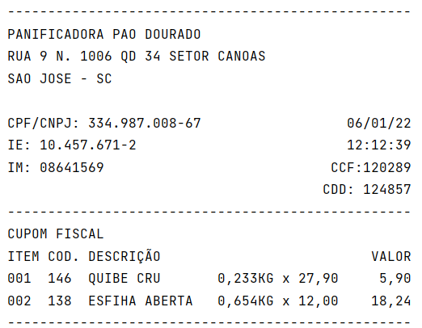

# Atividade MJV School - Expressões

As expressões em Java são construções que combinam operadores, valores literais, variáveis e métodos para realizar cálculos, avaliar condições e produzir resultados. Elas são fundamentais para a lógica e manipulação de dados em programas Java.

Para esse exericio utilizamos expressões para formatação de um cupom fiscal:

## Informações (modelo):

## Resultado:

